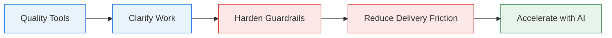

{}
Contributed by {}.

AI adoption stress-tests your organization. It does not create new problems - it reveals
existing ones. Teams that try to accelerate with AI before fixing their delivery process get the
same result as putting a bigger engine in a car with no brakes. This page provides the
prescriptive sequence for incorporating AI safely, mirroring the
[brownfield migration phases](../migrate-to-cd/brownfield/).
{}

## The Key Insight

AI amplifies whatever system it is applied to. If your delivery process has strong guardrails,
fast feedback, and clear requirements, AI makes you faster. If your process has unclear
requirements, manual gates, fragile tests, and slow pipelines, AI makes those problems worse -
and it makes them worse faster.

**The sequence matters:** remove friction and add safety before you accelerate.

## The Progression

Quality Tools, Clarify Work, Harden Guardrails, Remove Friction, then Accelerate with AI. Skipping steps means AI amplifies your weaknesses instead of your strengths.

## Quality Tools

**Brownfield phase:** Assess

Before using AI for anything, choose models and tools that minimize hallucination and rework.
Not all AI tools are equal. A model that generates plausible-looking but incorrect code creates
more work than it saves.

**What to do:**

- Evaluate AI coding tools on accuracy, not speed. A tool that generates correct code 80% of
  the time and incorrect code 20% of the time has a hidden rework tax on every use.
- Use models with strong reasoning capabilities for code generation. Smaller, faster models are
  appropriate for autocomplete and suggestions, not for generating business logic.
- Establish a baseline: measure how much rework AI-generated code requires before and after
  changing tools. If rework exceeds 20% of generated output, the tool is a net negative.

**What this enables:** AI tooling that generates correct output more often than not. Subsequent
steps build on working code rather than compensating for broken code.

## Clarify Work

**Brownfield phase:** Assess / Foundations

Use AI to improve requirements before code is written, not to write code from vague requirements.
Ambiguous requirements are the single largest source of defects
(see [Systemic Defect Fixes](../defect-sources/)), and AI can detect ambiguity faster than
manual review.

**What to do:**

- Use AI to review tickets, user stories, and acceptance criteria before development begins.
  Prompt it to identify gaps, contradictions, untestable statements, and missing edge cases.
- Use AI to generate test scenarios from requirements. If the AI cannot generate clear test
  cases, the requirements are not clear enough for a human either.
- Use AI to analyze support tickets and incident reports for patterns that should inform
  the backlog.

**What this enables:** Higher-quality inputs to the development process. Developers (human or AI)
start with clear, testable specifications rather than ambiguous descriptions that produce
ambiguous code.

## Harden Guardrails

**Brownfield phase:** Foundations / Pipeline

Before accelerating code generation, strengthen the safety net that catches mistakes. This means
both product guardrails (does the code work?) and development guardrails (is the code
maintainable?).

**Product and operational guardrails:**

- Automated test suites with meaningful coverage of critical paths
- Deterministic CD pipelines that run on every commit
- Deployment validation (smoke tests, health checks, canary analysis)

**Development guardrails:**

- Code style enforcement (linters, formatters) that runs automatically
- Architecture rules (dependency constraints, module boundaries) enforced in the pipeline
- Security scanning (SAST, dependency vulnerability checks) on every commit

**What to do:**

- Audit your current guardrails. For each one, ask: "If AI generated code that violated this,
  would our pipeline catch it?" If the answer is no, fix the guardrail before expanding AI use.
- Add [contract tests](../testing/) at service boundaries. AI-generated code is
  particularly prone to breaking implicit contracts between services.
- Ensure test suites run in minutes, not hours. Slow tests create pressure to skip them, which
  is dangerous when code is generated faster.

**What this enables:** A safety net that catches mistakes regardless of who (or what) made them.
The pipeline becomes the authority on code quality, not human reviewers. See
[Pipeline Enforcement and Expert Agents](../pipeline-enforcement/) for how these guardrails
extend to agentic CD.

## Reduce Delivery Friction

**Brownfield phase:** Pipeline / Optimize

Remove the manual steps, slow processes, and fragile environments that limit how fast you can
safely deliver. These bottlenecks exist in every brownfield system and they become acute when AI
accelerates the code generation phase.

**What to do:**

- Remove manual approval gates that add wait time without adding safety
  (see [Replacing Manual Validations](../migrate-to-cd/brownfield/replacing-manual-validations/)).
- Fix fragile test and staging environments that cause intermittent failures.
- Shorten branch lifetimes. If branches live longer than a day, integration pain will increase
  as AI accelerates code generation.
- Automate deployment. If deploying requires a runbook or a specific person, it is a bottleneck
  that will be exposed when code moves faster.

**What this enables:** A delivery pipeline where the time from "code complete" to "running in
production" is measured in minutes, not days. AI-generated code flows through the same pipeline
as human-generated code with the same safety guarantees.

## Accelerate with AI

**Brownfield phase:** Optimize / Continuous Deployment

Now - and only now - expand AI use to code generation, refactoring, and autonomous contributions.
The guardrails are in place. The pipeline is fast. Requirements are clear. The outcome of every
change is deterministic regardless of whether a human or an AI wrote it.

{}
Teams commonly jump straight to AI-generated tests without the infrastructure from the first four
stages underneath.

The distinction matters: humans must define what to test (scenarios, edge cases, acceptance
criteria). An agent can generate the test code from those specifications, but only if it is
validated for behavior focus and spec fidelity. See
[Executable Truth](../first-class-artifacts/#4-executable-truth) for the validation properties.

Without that foundation, teams get tests that look right and verify nothing. The AI is not the
problem. The missing specifications and validation are.
{}

**What to do:**

- Use AI for code generation with the specification-first workflow described in
  [the agentic CD workflow](../). Define test scenarios first, let AI generate
  the test code (validated for behavior focus and spec fidelity), then let AI generate
  the implementation.
- Use AI for refactoring: extracting interfaces, reducing complexity, improving test coverage.
  These are high-value, low-risk tasks where AI excels.
- Use AI to analyze incidents and suggest fixes, with the same pipeline validation applied to
  any change.

**What this enables:** AI-accelerated development where the speed increase translates to faster
delivery, not faster defect generation. The pipeline enforces the same quality bar regardless of
the author. See [Pitfalls and Metrics](../pitfalls-and-metrics/) for what to watch for and how
to measure progress.

## Mapping to Brownfield Phases

| AI Adoption Stage | Brownfield Phase | Key Connection |
|-------------------|-----------------|----------------|
| Quality Tools | Assess | Use the [current-state assessment](../migrate-to-cd/migration-path/assess/) to evaluate AI tooling alongside delivery process gaps |
| Clarify Work | Assess / Foundations | AI-generated test scenarios from requirements feed directly into [work decomposition](../migrate-to-cd/migration-path/foundations/work-decomposition/) |
| Harden Guardrails | Foundations / Pipeline | The [testing fundamentals](../migrate-to-cd/migration-path/foundations/testing-fundamentals/) and pipeline gates are the same work, with AI-readiness as additional motivation |
| Reduce Delivery Friction | Pipeline / Optimize | [Replacing manual validations](../migrate-to-cd/brownfield/replacing-manual-validations/) unblocks AI-speed delivery |
| Accelerate with AI | Optimize / CD | The [six first-class artifacts](../first-class-artifacts/) become the delivery contract once the pipeline is deterministic and fast |

## Related Content

- [Brownfield CD Overview](../migrate-to-cd/brownfield/) - the phased migration approach this roadmap parallels
- [Replacing Manual Validations](../migrate-to-cd/brownfield/replacing-manual-validations/) - the core mechanical cycle for Reduce Delivery Friction
- [Systemic Defect Fixes](../defect-sources/) - catalog of defect causes that AI can help detect during Clarify Work
- [Agentic CD](../) - the destination for teams completing this roadmap
- [Anti-Patterns](../anti-patterns/) - problems that Harden Guardrails and Reduce Delivery Friction are designed to eliminate
- [The Six First-Class Artifacts](../first-class-artifacts/) - the artifacts that Accelerate with AI's specification-first workflow requires
- [Pipeline Enforcement and Expert Agents](../pipeline-enforcement/) - how the pipeline enforces the guardrails from Harden Guardrails and Reduce Delivery Friction
- [Pitfalls and Metrics](../pitfalls-and-metrics/) - common failures when steps are skipped, and how to measure progress
