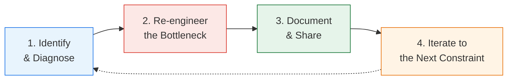

{}
The principles describe how to think. The loop describes what to do, repeatedly. Like the delivery
lifecycle itself, bottleneck removal is not a project with an end state. It is a cycle you run, and
keep running, because every constraint you remove exposes the next one. This page is the playbook.
{}

## The Loop

Use AI in every phase, not only to write code, but to solve old coordination problems in new ways.

## Phase 1: Identify and Diagnose

You cannot remove a bottleneck you have not named. This phase produces a bottleneck map and a
[classification](), and it starts with
the real system rather than a maturity model. Use two techniques that work together.

### Technique 1: Walk the Value Stream (the Litmus Test)

Take something from your backlog that is small, predictable, and meaningful enough to touch the
real delivery system. Observe a developer, and where appropriate an agent, work the change from idea
to production readiness, and record four things:

- **Steps and elapsed time** - where the work actually went.
- **Developer interventions** - every moment a human must supply context, make a judgment, execute a
  manual step, recover from tool friction, or interpret unclear feedback.
- **Handoffs and approvals** - how many people must touch or sign off on the change.
- **Agentic friction** - the quieter signal: where an agent can act, but not efficiently or safely.
  It searches for knowledge that should be discoverable, writes a test that does not reflect business
  behavior, waits on an environment that is hard to start, or makes a plausible change that violates
  an implicit standard.

This is not a performance review of the developer or the agent. It is a performance review of the
system. Ask where the work waited, where it required tribal knowledge, where safety depended on
manual judgment, where security or compliance entered too late, and where the pipeline gave a clear
next action instead of just saying no. The output is a map of exactly where the value stream stops.

### Technique 2: Context Harvesting (Read the Process Exhaust with AI)

Walking the value stream shows you where work stops. Context harvesting shows you why. Most of the
knowledge about how work really flows is not in a process diagram. It is scattered across emails,
chat threads, wiki pages, tickets, runbooks, meeting transcripts, and architecture decision records.
People navigate it by knowing whom to ask. An agent cannot, and neither can a new teammate.

Point AI at that exhaust. Have it read the chat history around a stuck request, the wikis and
runbooks for a service, the ticket trail of a recurring delay, and the transcripts of the meetings
where decisions were actually made. Then ask it to piece together the real process: who is involved,
what each handoff waits on, where the same questions get re-asked, and which knowledge lives in a
single person's head. What once took weeks of interviews now takes an agent a few hours.

Context harvesting does double duty. It speeds up the diagnosis, and it produces the first durable
artifact, a written account of how the process actually works, that Phase 3 will build on. In the
agent era, the context you harvest here becomes infrastructure later.

The output of Phase 1 is a named, classified constraint, mapped to where it lives in the lifecycle.

## Phase 2: Re-engineer the Bottleneck

Once the constraint is named, resist the reflex to add another meeting, dashboard, or escalation
path. Those preserve the underlying dependency. The better question is: what dependency can we
remove?

- If audit evidence requires ten follow-ups, the answer is not a better follow-up tracker. It is an
  evidence system with clear ownership, known sources, and automated collection.
- If capacity requests wait for months, the answer is not a more urgent email. It is a self-service
  workflow with decision rights, budget rules, and provisioning paths.
- If every design waits on the same architect, the answer is not more architect hours. It is
  architecture guidance teams and agents can apply without waiting.

Re-engineer by applying the
[five AI Enablement Properties]()
and aim them at Layers 2 and 3, the process and the organization, not just Layer 1, the code. The
three levers from *Wiring the Winning Organization* are how you rewire the architecture:
slowification (slow down to design the work before you run it), simplification (break the work into
smaller, independent, more linear steps), and amplification (make problems visible the moment they
appear). The leadership move is choosing which dependency to remove. AI is how you remove it.

**Put safety and security on the same path as speed.** Re-engineering is not a permission slip for
uncontrolled change. It is the opposite. If agents produce more change, the organization needs
stronger proof that change is acceptable, and that proof must live in the path every change travels,
not in late human review. A re-engineered bottleneck carries its safety with it: clear intent and
acceptance criteria, behavioral tests tied to outcomes, security and policy checks in the pipeline,
architecture constraints as enforceable rules, traceability from request to deployment, observable
production behavior, rollback, and a named owner for every service and evidence source. See
[Pipeline Enforcement and Expert Agents]().

## Phase 3: Document and Share

A local improvement no one else can find becomes another silo. The work is not done when the
bottleneck is gone. It is done when the next team, and the next agent, can remove the same class of
constraint without rediscovering how.

The best operators do not just solve problems where they occur. They deliberately spread the
knowledge throughout the organization. One without the other stalls.

- **Local learning** - capture the solution where the work happened, in durable form: a prompt, a
  runbook, a pipeline check, an architecture decision record, a service-ownership record, a
  test-generator pattern, an evidence template. The test is simple: can the next team apply this
  without asking the original team to explain it?
- **Global learning** - make the pattern travel. Publish it where humans and agents discover it in
  the flow of work: a living system of examples, prompts, artifacts, and outcomes, not a portal of
  stale documents. The question shifts from "did one team improve?" to "can the improvement move
  across the org?"

In the agent era, context is infrastructure. Documentation is not the tax at the end of the work. It
is the mechanism that converts a one-time fix into organizational capability, readable by the next
teammate and the next agent alike.

## Phase 4: Iterate to the Next Constraint

Removing one constraint does not finish the system. It reveals the next one. That is not failure. It
is the loop working as designed.

This is where the physics pays off. The
[Golden Rule]() holds
that removing a dependency roughly doubles your odds, so each turn of the loop compounds the last.
The goal is not to declare the system transformed. It is to build the reflex - identify,
re-engineer, document and share, iterate - until removing bottlenecks is the team's operating rhythm
rather than a one-time initiative. When the whole organization runs the loop, coordination costs
compound downward: every dependency removed improves the odds for every team that touches the same
flow.

## What to Do Next

Start small, but start with the real system. Choose one backlog item, one audit evidence flow, one
capacity request, one design approval, or one deployment gate. Then:

1. Run the litmus walk.
2. Name the bottleneck and classify it.
3. Identify which dependency must be removed.
4. Use AI to help re-engineer the work.
5. Move safety and security into the flow.
6. Document the pattern and share it.

Then repeat. Do not wait for an enterprise AI operating model to be perfect. Do not wait for every
team to agree on a maturity framework. Do not measure success by adoption alone. Measure whether
work moves faster because the system has become clearer, safer, more automated, and less dependent
on hidden human coordination. The teams that become fast will not be the teams that chase speed
directly. They will be the teams that remove friction, improve quality, and make safety executable.

## Related Content

- [Where the Bottleneck Moves]() - the classification Phase 1 produces
- [Use AI to Find Friction Before You Use It to Go Faster]() - the properties you apply in Phase 2
- [AI Adoption Roadmap]() - one full pass of this loop, sequenced for practitioners
- [Replacing Manual Validations]() - the mechanical cycle for moving controls into the pipeline

---

Content contributed by {}.
