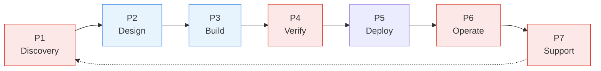

{}
AI compresses the making phases of delivery hardest and barely touches the rest. So as creation
cost falls, the constraint does not disappear. It moves outward to the phases AI does not
cheapen. This page gives you a shared map of the delivery lifecycle and the five categories of
bottleneck that map onto it, each with its agent-speed signal and the intervention pattern that
removes it.
{}

## The Product Delivery Lifecycle

To turn "where does work stop?" into a classification you can act on, you need a shared map of the
journey, one stable enough that business, engineering, security, and audit can all point to the same
place and mean the same thing. Stripped to its spine, the product delivery lifecycle (PDLC) has
seven phases, and it loops, because delivery is a cycle, not a line.

Each phase answers one question:

- **Discovery** decides what is worth building and why.
- **Design** decides how it should work.
- **Build** implements it.
- **Verify** proves it is correct, secure, and safe to release.
- **Deploy** approves the change and moves it to production.
- **Operate** runs it reliably.
- **Support** sustains, fixes, and improves it, and feeds what it learns back into the next
  Discovery.

This is not a custom model. It lines up with the backbone of the major lifecycle frameworks - the
classic SDLC, the DevOps loop, and ISO/IEC/IEEE 12207. We use plain verbs so every discipline can
read the same map.

## The Bottleneck Moves to the Ends

The reason a delivery leader should care about the map is what AI does to it. AI compresses the
making phases hardest, **Design and Build** (shown in blue above), because that is the work AI is
most able to generate. It barely touches the rest. So as creation cost falls, the
constraint moves outward to the phases generation does not cheapen (shown in red):

- **Discovery**, where the hard part is deciding what is worth building.
- **Verify**, where correctness, security, and trust still have to be proven. A cheap-to-write change
  is not a cheap-to-trust one.
- **Operate and Support**, where the system has to run and be sustained in the real world.

This is the asymmetry from
[Principle 3]()
drawn onto the lifecycle: AI can do the work, but it cannot accept it. The
bottleneck moves from the middle of the PDLC to its ends.

## The Five Bottleneck Categories

Most agent-speed delivery problems fall into five categories, each anchored to a phase of the PDLC.
Name the category to know the intervention. Find it on the lifecycle to know where to look.

| Bottleneck | PDLC phase | Agent-speed signal | Intervention pattern |
|------------|-----------|--------------------|----------------------|
| **BN-1 Discovery & Requirements Churn** | Discovery | The agent builds the wrong thing quickly | Use AI to synthesize requirements, expose ambiguity, and generate testable acceptance criteria before implementation |
| **BN-2 Architecture & Design Gatekeeping** | Design | The agent crosses unclear boundaries or overloads scarce experts | Make constraints explicit: decision records, service maps, dependency rules, paved-path examples, automated checks |
| **BN-3 Testing & Quality Friction** | Build / Verify | Generation outpaces review; generated tests check implementation, not behavior | Use AI to expand behavioral coverage and edge cases, but validate tests against known failure modes before trusting them |
| **BN-4 Change Management & Deployment Gates** | Deploy | Same-day fixes wait for windows, approvals, or readiness rituals | Move controls into the pipeline, automate evidence, standardize risk classification, shrink batch size, improve rollback |
| **BN-5 Knowledge Silos & Team Coupling** | Operate / Support | The agent stalls without the human who knows where the tool lives or who owns the service | Create discoverable ownership records, runbooks, service catalogs, and agent-accessible knowledge bases |

Read the categories against the migration and the pattern is plain. The bottlenecks AI pressures
cluster at the ends of the lifecycle - BN-1 at Discovery, BN-3 across Build and Verify, BN-5 at
Operate and Support - exactly the phases generation does not make cheaper. BN-2 and BN-4 are the
gate problems in between: controls an organization survives at human speed but that turn into
queues the moment implementation accelerates. Both kinds are coordination costs. The map tells you
which is which.

## Where Each Category Points on This Site

The interventions above are not abstract. Each category maps to existing guidance you can act on
today.

| Bottleneck | Where to go next |
|------------|------------------|
| **BN-1 Discovery** | [Agent-Assisted Specification]() and the [Intent Description]() artifact |
| **BN-2 Design** | [Agentic Architecture Patterns](), the [Feature Description constraints](), and [Everything as Code]() |
| **BN-3 Testing** | [Testing Fundamentals]() and the [Evaluation & Quality]() pages |
| **BN-4 Deployment** | [Single Path to Production](), [Replacing Manual Validations](), and [Pipeline Enforcement]() |
| **BN-5 Knowledge** | [Repository Readiness]() and [Configuration Quick Start]() |

The output of classification is a named, classified constraint, mapped to where it lives in the
lifecycle, not a hunch. The next page turns that into a method.

## Related Content

- [The Bottleneck Removal Loop]() - the four-phase method that identifies, classifies, and removes each constraint
- [Why Coordination, Not Coding, Sets the Pace]() - why the constraint exists in the first place
- [Use AI to Find Friction Before You Use It to Go Faster]() - the asymmetry that drives the migration

---

Content contributed by {}.
