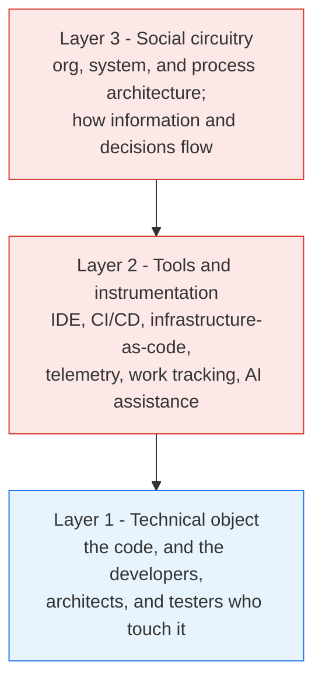

{}
AI changed the economics of creating software. It did not touch the physics of delivering it.
Value still flows through a system of people, tools, and decisions, and in most enterprises that
system is governed not by how fast anyone writes code but by how long work waits. The constraint is
coordination, not creation. This page is the physics behind that claim.
{}

## Three Forces Set the Speed of Any Flow

Coordination cost is not a vague complaint. When work crosses people and teams, three forces govern
how long it takes.

### 1. Wait time rises with utilization

Wait time scales with how busy a resource is, roughly as `%busy / %idle`. A resource that is 90%
busy makes work queue at about nine times its own duration. This is why busy people feel productive
while everything waiting on them slows down. The fix for flow is rarely "work harder." It is to
stop loading shared resources to the point where queues explode.

### 2. Coordination risk compounds

Each [dependency]() roughly halves your odds of
arriving on time with quality. With `n` dependencies, a clean on-time pass is about 1 in 2ⁿ.

| Dependencies | On-time odds |
|:---:|:---:|
| 1 | 50% |
| 2 | 25% |
| 3 | 12% |
| 4 | 6% |

Every team you must wait on, every approval, every shared environment is another coin flip you have
to win.

### 3. Knowledge decays across handoffs

The unwritten knowledge surviving `n` handoffs is about 1 / 2ⁿ. Half is lost at the first handoff,
three-quarters by the second. The intent in someone's head does not travel cleanly across an email,
a ticket, and a standup. What arrives at the far end is a lossy copy.

## The Three C's of Coordination Cost

Those forces surface as three recurring problems. Name them and you can attack them.

| The C | What it is |
|-------|------------|
| **Contention** | Queuing for shared people and resources. The architect everyone needs. The one environment everyone tests in. |
| **Coupling** | Your work cannot finish until someone else's does. A cross-team dependency, a shared release train, a sign-off you do not control. |
| **Coherence** | Everyone needs the same current understanding. The requirement's real intent, the architecture rule no one wrote down, the unspoken definition of "done." |

They conspire to make it unlikely you arrive on time, with quality. Contention and Coupling create
the queues. Coherence is the knowledge that decays on the way.

### Underneath the Three C's: Knowledge

Look closely and the three C's are one constraint wearing three coats. Contention is waiting for the
person who *knows*. Coupling is needing knowledge or output that lives with someone else. Coherence
*is* shared knowledge, decaying at every handoff. The dependency you wait on is almost always a
dependency on something someone else knows and you do not. That is why knowledge is the deepest
constraint in delivery: remove a knowledge dependency - make the understanding discoverable rather
than locked in a person - and you drain a queue, decouple a team, and restore coherence at once. The
rest of this subsection is, at root, about finding and removing knowledge dependencies.

## The Golden Rule

From the same math comes the single lever that matters.

> **Removing a dependency roughly doubles your odds of arriving on time with quality.**

It is the inverse of the 1-in-2ⁿ curve. Go from four dependencies to three and your odds rise from
6% to 12%. From three to two, 12% to 25%. This is why the leadership move is dependency removal, not
local acceleration. You do not win by making one step faster. You win by deleting a step you used to
wait on.

## Where the Dependencies Live

If coordination is the constraint, where in the organization does it sit? In *Wiring the Winning
Organization*, Steven Spear and Gene Kim describe any organization as three layers.

Most AI effort lands on Layer 1, the code. The coordination cost lives in Layers 2 and 3, the tools
and the social circuitry. That is the mismatch this whole subsection exists to correct.

## The Numbers Make the Misdiagnosis Unmistakable

Map a typical enterprise [value stream]()
and the [lead time]() runs about 281
days. Actual coding is roughly 32 of them, about 12%.

| Slice of lead time | Days | Share |
|--------------------|:----:|:-----:|
| Actual coding | ~32 | ~12% |
| Everything else (waiting, coordination, approvals, handoffs) | ~249 | ~88% |

So the reflex "developers are slow, let's add AI" aims at the wrong target:

- Make coding 50% faster and you save about 16 days. A 6% improvement.
- Take coding all the way to zero and roughly 88% of lead time is untouched.

The constraint was never the typing. It is everything around it. That is the physics, and the rest
of this subsection follows from it: the highest-leverage use of AI is not to write more code, but to
remove the dependencies that dominate the other 88%.

## Sources

- Scott Prugh, "Coordination Costs and How Organizations Win with AI," Forum 2026 - the coordination-cost model this page synthesizes.
- Steven Spear and Gene Kim, *Wiring the Winning Organization*, IT Revolution, 2023 - the three-layer model and the simplification levers used in [the removal loop]().
- Gene Kim, Kevin Behr, and George Spafford, *The Phoenix Project* - the wait-time-rises-with-utilization result, popularized for technology leaders.
- Troy Magennis - modeling of how each added dependency compounds delivery-schedule risk.
- Mary and Tom Poppendieck, *Lean Software Development* - tacit-knowledge loss across handoffs.

## Related Content

- [Use AI to Find Friction Before You Use It to Go Faster]() - the stance and the five properties that turn the Golden Rule into action
- [Where the Bottleneck Moves]() - which dependencies surface where, as agent speed rises
- [Value Stream Map]() - the mapping technique behind the 281-day number

---

Content contributed by {}.
