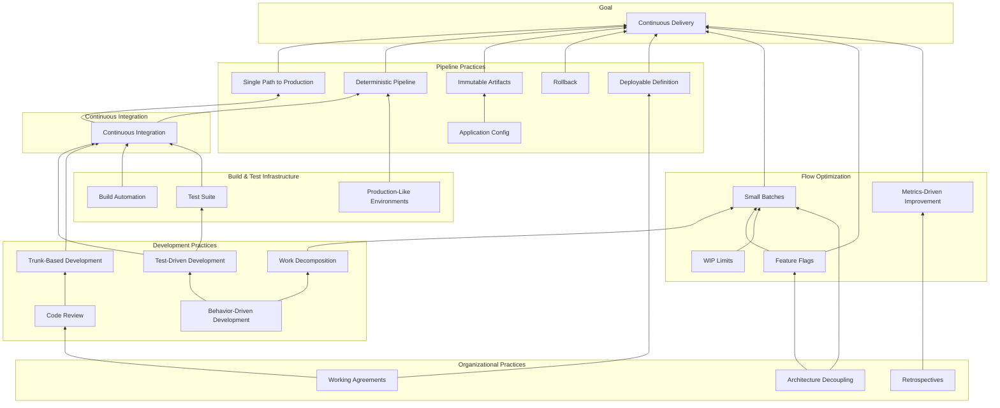

{}
Adapted from [Dojo Consortium](https://dojoconsortium.org)
{}

Continuous delivery is not a single practice you adopt. It is a system of interdependent
practices where each one supports and enables others. This dependency tree shows those
relationships. Understanding the dependencies helps you plan your migration in the right
order -- addressing foundational practices before building on them.

## The Dependency Tree

The diagram below shows how the core practices of CD relate to each other. Read it from
bottom to top: lower practices enable higher ones. The migration phases in this guide are
sequenced to follow these dependencies.

## How to Read the Dependency Tree

Each arrow means "supports" or "enables." When practice A has an arrow pointing to practice B,
it means A is a prerequisite or enabler for B.

**Key dependency chains to understand:**

### BDD enables TDD enables CI enables CD

Behavior-Driven Development produces clear, testable acceptance criteria. Those criteria drive
Test-Driven Development at the code level. A comprehensive, fast test suite enables
Continuous Integration with confidence. And CI is the foundational prerequisite for CD.

If your team skips BDD, stories are ambiguous. If stories are ambiguous, tests are incomplete
or wrong. If tests are unreliable, CI is unreliable. And if CI is unreliable, CD is impossible.

### Work Decomposition enables Small Batches enables CD

You cannot deploy small batches if your work items are large. Work decomposition -- breaking
features into [vertical slices](../glossary/#vertical-sliced-story) that can each be completed in
two days or less -- is what makes small batches possible. Small batches in turn reduce
deployment risk and enable the rapid feedback that CD depends on.

### Trunk-Based Development enables CI

CI requires that all developers integrate to a shared trunk at least once per day. If your team
uses long-lived feature branches, you are not doing CI regardless of how often your build server
runs. TBD is not optional for CD -- it is a prerequisite.

### Architecture Decoupling enables Feature Flags and Small Batches

Tightly coupled architectures force coordinated deployments. When changing service A requires
simultaneously changing services B and C, small independent deployments become impossible.
Architecture decoupling -- through well-defined APIs, contract testing, and service boundaries
-- enables teams to deploy independently, use feature flags effectively, and maintain small
batch sizes.

## Mapping to Migration Phases

The dependency tree directly informs the sequencing of migration phases:

| Dependency Layer | Migration Phase | Why This Order |
|-----------------|-----------------|----------------|
| Development practices (TBD, TDD, BDD, work decomposition, code review) | [Phase 1 -- Foundations](../../migration-path/foundations/) | These are prerequisites for CI, which is a prerequisite for everything else |
| Build and test infrastructure (build automation, test suite, production-like environments) | [Phase 1](../../migration-path/foundations/) and [Phase 2](../../migration-path/pipeline/) | You need a reliable build and test infrastructure before you can build a reliable pipeline |
| Pipeline practices (single path, deterministic pipeline, immutable artifacts, config, rollback) | [Phase 2 -- Pipeline](../../migration-path/pipeline/) | The pipeline depends on solid CI and development practices |
| Flow optimization (small batches, feature flags, WIP limits, metrics) | [Phase 3 -- Optimize](../../migration-path/optimize/) | Optimization requires a working pipeline to optimize |
| Organizational practices (working agreements, retrospectives, architecture decoupling) | All phases | These cross-cutting practices support every phase and should be established early |

## Using the Tree to Diagnose Problems

When something in your delivery process is not working, trace it through the dependency tree
to find the root cause.

**Example 1: Deployments keep failing.**
Look at what feeds CD in the tree. Is your pipeline deterministic? Are you using immutable
artifacts? Is your application config externalized? The failure is likely in one of the
pipeline practices.

**Example 2: CI builds are constantly broken.**
Look at what feeds CI. Are developers actually practicing TBD (integrating daily)? Is the test
suite reliable, or is it full of flaky tests? Is the build automated end-to-end? The broken
builds are a symptom of a problem in the development practices layer.

**Example 3: You cannot reduce batch size.**
Look at what feeds small batches. Is work being decomposed into vertical slices? Are feature
flags available so partial work can be deployed safely? Is the architecture decoupled enough
to allow independent deployment? The batch size problem originates in one of these upstream
practices.

{}
When you encounter a problem, resist the urge to fix the symptom. Use the dependency tree to
trace the problem to its root cause. Fixing the symptom (for example, adding more manual
testing to catch deployment failures) will not solve the underlying issue and often adds
toil that makes things worse. Fix the dependency that is broken, and the downstream problem
resolves itself.
{}

## Practices Not Shown

The tree above focuses on the core technical and process practices. Several important
supporting practices are not shown for clarity but are covered elsewhere in this guide:

- **Observability and monitoring** -- essential for [progressive rollout](../../migration-path/continuous-deployment/progressive-rollout/) and fast incident response
- **Security automation** -- integrated into the pipeline as automated checks rather than manual gates
- **Database change management** -- a common constraint addressed during [pipeline architecture](../../migration-path/pipeline/pipeline-architecture/)
- **Team topology and organizational design** -- addressed through [working agreements](../../migration-path/foundations/working-agreements/) and architectural decoupling

---

> This content is adapted from the [Dojo Consortium](https://dojoconsortium.org),
> licensed under [CC BY 4.0](https://creativecommons.org/licenses/by/4.0/).
